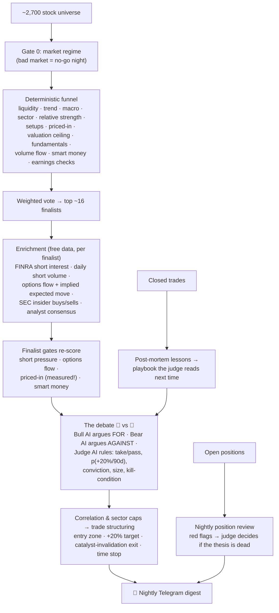

# Catalyst Anticipation Swing Bot

A nightly stock scanner that hunts for US stocks likely to rise **+20% within 90 days** because a catalyst is *coming* and the market hasn't priced it in yet — then argues with itself before telling you about it.

Every market night at 22:00 ET it scans ~2,700 liquid US stocks, runs survivors through a funnel of quantitative gates, lets a bull AI and a bear AI debate the finalists in front of an AI judge, and sends **one Telegram digest**: rare high-conviction buy ideas, a watchlist of near-misses, exit warnings for open ideas, and a one-line portfolio pulse.

> **This is an alerts-only research tool, not an autotrader, and not financial advice.** It never places orders. Its picks are tracked in a paper journal to measure whether they would have worked.

## How it works



**The core idea:** most screeners find stocks that already moved. This one tries to reject those. Gate 5.3 literally measures it — the price of an options straddle at the post-catalyst expiry implies how big a move the market already expects; if the implied move is ≥ our +20% target, the catalyst is priced in and the stock is rejected.

**The debate:** a single AI asked "is this good?" tends to agree with the data it's handed. Forcing the strongest honest bear case first — and making a judge weigh both sides plus a playbook of lessons from every past closed trade — is how weak picks get caught at the door. No judge available (no API keys, cost cap hit) = no buys, ever.

**The learning loop:** every closed trade gets a one-line AI post-mortem appended to `.state/playbook.md`; the judge reads it before every future verdict. A separate numeric tuner nudges per-gate weights from realized returns once ≥20 trades have closed.

## A nightly digest looks like

```
🌙 Nightly digest — 2026-07-06

🟢 Buy alerts (+20% / 90d bar):
  • STX — size HALF, conviction 8/10, p 41% (full plan follows)

👀 Watchlist (NOT buy signals):
  • CSCO: conviction 6/10, p(target) 12% — priced in; options imply only ~19% move
  • AVGO: conviction 7/10, p(target) 15% — strong setup, weak macro

🏥 Exit early:
  • ADTN (-25.1%) — catalyst passed without the move; trend broken

📊 34 open avg -3.5% (SPY same-dates +0.8%); 13 closed avg +20.6%
```

Nights with zero buys are normal and intentional — the digest says so instead of padding with weak picks.

## Quickstart

Requires Python 3.10+ (developed on 3.14).

```bash
git clone https://github.com/Ro15/analyser.git && cd analyser
python3 -m venv venv && ./venv/bin/pip install -r requirements.txt
cp .env.example .env        # optional: fill in keys; NOT needed for the dry run

# Full pipeline, zero API keys, zero network for the AI parts:
LLM_MOCK=1 ./venv/bin/python scan.py --universe 40

# Single-stock report:
./venv/bin/python analyze.py NVDA

# Live data but writes nothing and sends nothing (safe rehearsal):
./venv/bin/python scan.py --shadow

# The real nightly run (sends Telegram if TELEGRAM_* are set in .env):
./venv/bin/python scan.py --live

# Install the 22:00 ET weeknight schedule (macOS launchd):
bash scripts/install_schedule.sh
```

Run the tests (all offline, synthetic fixtures):

```bash
LLM_MOCK=1 ./venv/bin/python -m pytest -q
```

## Data sources — all free

| Signal | Source | Keyless |
|---|---|---|
| Prices, fundamentals, options chains, analyst consensus | yfinance (via OpenBB) | ✅ |
| Short interest, days-to-cover | FINRA (via OpenBB) | ✅ |
| Daily short / dark-pool volume | Stockgrid (via OpenBB) | ✅ |
| Insider transactions (Form 4) | SEC EDGAR (via OpenBB) | ✅ |
| News headlines | Multi-source RSS/scrape | ✅ |
| Bull/bear analysts + post-mortems | DeepSeek | key in `.env` |
| The judge | Claude (DeepSeek fallback) | key in `.env` |

Every enrichment fetch degrades to a neutral gate score on failure — a downed provider can never kill the scan. All OpenBB access is contained in one module (`data/ingest/openbb_source.py`). AI spend is enforced by a **hard monthly cost cap** in code (default $20; actual usage runs a few cents/night).

## Configuration

Every threshold lives in [`config.yaml`](config.yaml) — gate cutoffs, the +20% target, debate minimums (judge conviction, probability), position-review red-flag thresholds, the AI cost cap — so behavior is tunable and backtestable without touching code.

## Project structure

```
scan.py                  # nightly entry point (funnel → debate → digest)
analyze.py               # one-stock report
engine/                  # funnel, enrichment, debate, structuring, LLM client
gates/                   # one gate per file: check(ticker, data) -> GateResult
data/ingest/             # universe, prices, news, EDGAR, OpenBB sources
catalyst/                # catalyst calendar + supplier/customer read-through map
alerts/                  # digest + alert formatting, Telegram sender
journal/                 # paper journal, position review, post-mortems, playbook, tuner, dashboard
backtest/                # replay harness + metrics (prints its bias warnings)
tests/                   # 130+ offline tests on synthetic data
```

## Guardrails (by design, never removed)

- **Alerts only.** No order placement code in the pipeline.
- **No real capital** unless paper results beat buying SPY over the full validation window — checked via `./venv/bin/python -m journal.dashboard`.
- **Valuation ceiling:** names in the top decile of their own ~5-year valuation range are rejected (anti-FOMO).
- **Thesis-based exits:** a position is closed early only when ≥2 deterministic red flags fire AND the AI judge confirms the thesis is dead. Price weakness alone never triggers an exit.
- **Unvetted = watchlist:** if no AI judge is available, nothing can become a buy.
- **Honest backtests:** the replay always prints its survivorship-bias warning, and notes that options/short-volume/insider signals have no free history (they're validated in paper tracking only).
- **No secrets in the repo:** all keys come from `.env`.

## Disclaimer

For research and education. Nothing here is investment advice; markets can and will disagree with any model. Do your own diligence.
